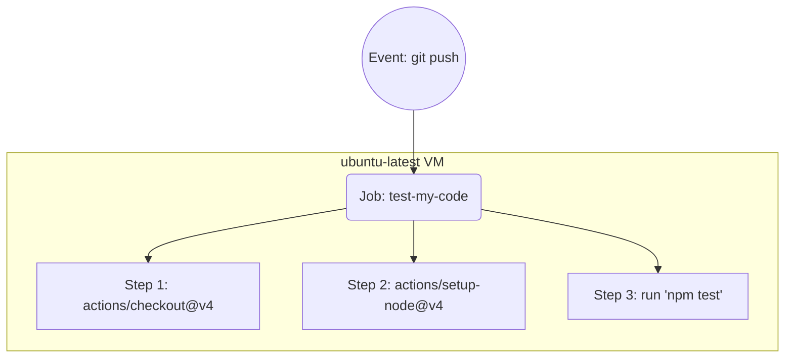

# Topic 1: Basics & Pre-built Actions

## 📖 Core Concepts
A **Workflow** is an automated process triggered by an event (like pushing code). It contains **Jobs**, which contain **Steps**.

### Architecture Diagram


## 🛠️ Key Components
- **`on:`** The event that triggers the workflow.
- **`runs-on:`** The type of virtual machine the job runs on (e.g., `ubuntu-latest`).
- **`uses:`** Calls a pre-built Action (reusable code).
- **`run:`** Executes a standard shell command.

## 📝 Example Workflow
```yaml
name: Run Tests

on: [push]

jobs:
  test-my-code:
    runs-on: ubuntu-latest
    steps:
      - name: Checkout Code
        uses: actions/checkout@v4
        
      - name: Setup Node.js
        uses: actions/setup-node@v4
        with:
          node-version: '24'
          
      - name: Run my test script
        run: npm test
```
