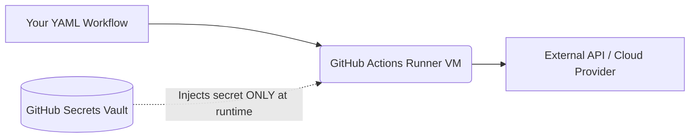

# Topic 2: Secrets and Variables

## 📖 Why use Secrets and Variables?
When building real applications, you often need to connect to databases, third-party APIs, or cloud providers (like AWS). You should **never** hardcode passwords or API keys in your code because anyone with access to the repo can steal them.

Instead, GitHub provides a secure vault to store these values, which are injected into your workflow at runtime.

### Data Flow Diagram


## 🛠️ The Two Types of Stored Data
1. **Variables (`vars`)**: Non-sensitive data that is safe to see (e.g., `PORT=8080`, `ENVIRONMENT=production`).
2. **Secrets (`secrets`)**: Sensitive data that is encrypted (e.g., `API_KEY=xyz123`, `DB_PASSWORD=secret`).

## 📝 How to use them in YAML
We access these values using GitHub's expression syntax: `${{ }}`. We usually pass them as Environment Variables (`env:`) to our steps.

```yaml
name: Deploy App

on: [push]

jobs:
  deploy:
    runs-on: ubuntu-latest
    steps:
      - name: Login to service
        # Inject secrets and variables into the environment for this step
        env:
          API_KEY: ${{ secrets.MY_PRODUCTION_API_KEY }}
          ENV_NAME: ${{ vars.TARGET_ENVIRONMENT }}
        run: |
          echo "Connecting to environment: $ENV_NAME"
          # The script can now use the $API_KEY variable securely!
          ./deploy.sh --key $API_KEY
```

> [!WARNING]
> Never run a command like `echo ${{ secrets.API_KEY }}`. While GitHub tries to mask secrets in the logs by replacing them with `***`, printing them directly is a major security risk.
