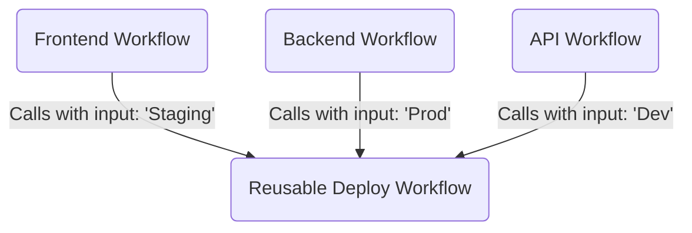

# Topic 4: Reusable Workflows

## 📖 The Problem (DRY - Don't Repeat Yourself)
Imagine you have 10 different projects or microservices. They all need to be tested and deployed using the exact same steps. 
If you copy-paste the YAML code into 10 different repositories, and one day you need to update a single step, you have to manually update 10 different files!

## 💡 The Solution: Reusable Workflows
GitHub Actions allows you to write a workflow once, and treat it like a "function". Other workflows can then "call" it and pass inputs to it.

### Architecture Diagram

## 🛠️ How it works

### 1. The Reusable Workflow
You create a workflow and use a special trigger: `on: [workflow_call]`. This tells GitHub: *"I cannot be triggered directly by a push. I can ONLY be called by another workflow."*
You can also define `inputs` (parameters) that it expects to receive.

### 2. The Caller Workflow
In your main workflow, instead of writing `steps:`, you use the `uses:` keyword pointing to the reusable workflow file, and provide the inputs using `with:`.
