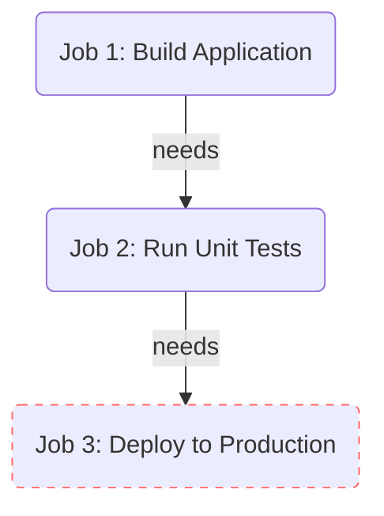

# Topic 5: Job Controls (`needs` and `if`)

## 📖 The Problem
By default, if you write multiple `jobs:` in a single workflow file, GitHub Actions runs them **all at the exact same time (in parallel)** to save time.

But what if you are deploying to Production? You absolutely want your `test` job to finish successfully *before* your `deploy` job starts.

## 💡 The Solution: `needs`
You can force a job to wait for another job to finish by using the `needs` keyword.

### Dependency Flow Diagram


## 💡 Conditional Execution: `if`
Sometimes you only want a job or step to run under specific conditions. For example, you want to run tests on every branch, but you ONLY want to deploy if the code was pushed to the `main` branch. 

You can control this using the `if` keyword.

## 📝 Example Workflow
```yaml
jobs:
  test:
    runs-on: ubuntu-latest
    steps:
      - run: echo "Running tests..."

  deploy:
    # 1. DEPENDENCY: Wait for 'test' to finish successfully
    needs: test 
    
    # 2. CONDITION: ONLY run if we are on the 'main' branch
    if: github.ref == 'refs/heads/main' 
    
    runs-on: ubuntu-latest
    steps:
      - run: echo "Deploying..."
```
