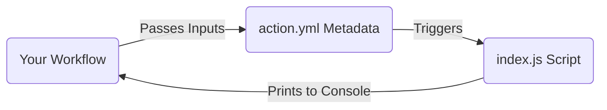

# Topic 6: Custom Actions

## 📖 What is a Custom Action?
Up until now, we have been using pre-built actions made by GitHub and other developers (like `uses: actions/checkout@v4`).

But what if you have a very specific, complex task that you want to share with other developers in your company? You can build your **own** Action!

## 🛠️ The 3 Types of Custom Actions
1. **Composite Actions**: Written in YAML. It basically bundles a bunch of standard `run:` steps together into one reusable action.
2. **JavaScript Actions**: Written in Node.js. Runs directly on the runner machine. Fast and highly customizable.
3. **Docker Actions**: Runs inside a Docker container. Best if your action requires a very specific operating system, binary, or complex dependencies.

## 🏗️ Structure of a JavaScript Action
To create a custom JavaScript Action, you need a folder with two main files:
1. `action.yml`: The metadata file. It tells GitHub the name of the action, what `inputs` it requires, and what script to execute.
2. `index.js`: The actual JavaScript code that runs.

### Flow Diagram

