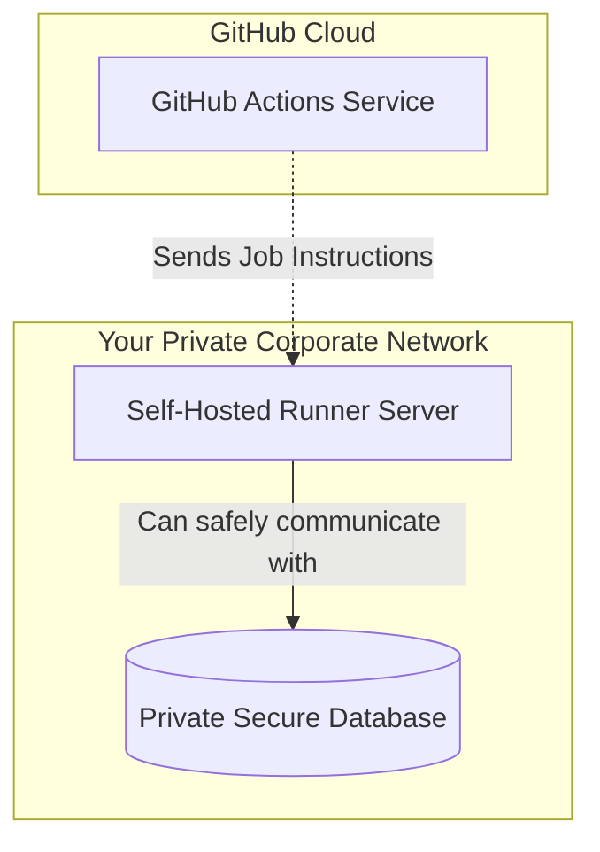

# Topic 7: Self-Hosted Runners

## 📖 The Problem
Until now, every time we used `runs-on: ubuntu-latest`, GitHub automatically provided a fresh Virtual Machine from their cloud, ran our code, and then immediately destroyed the VM. These are called **GitHub-hosted runners**.

However, in Enterprise environments, this is not always enough:
1. **Security:** GitHub's servers cannot access your company's private internal network or private databases behind a firewall.
2. **Cost:** Running very large builds (like compiling a massive game engine or training AI) on GitHub's servers can become very expensive.
3. **Specialized Hardware:** You might need to run tests on a machine with a powerful GPU or a specific operating system.

## 💡 The Solution: Self-Hosted Runners
A self-hosted runner is a machine that **you** manage (it could be your laptop, a server in AWS, or even a Raspberry Pi). You install a small background application on it, and it connects to GitHub to "listen" for jobs.

### Architecture Diagram


## 🛠️ How to use it in YAML
Once you register your machine with GitHub, you give it custom "labels" (e.g., `my-laptop` or `gpu-server`). Then, you just change the `runs-on` value in your workflow:

```yaml
jobs:
  test-on-private-server:
    # Instead of 'ubuntu-latest', we tell GitHub to send the job to our specific machine
    runs-on: [self-hosted, linux, x64, gpu-server]
    steps:
      - run: echo "This is running on MY private server!"
```

> [!WARNING]
> **Security Risk:** Never use self-hosted runners on public open-source repositories. A malicious user could open a Pull Request containing code that executes harmful commands directly on your private server!
