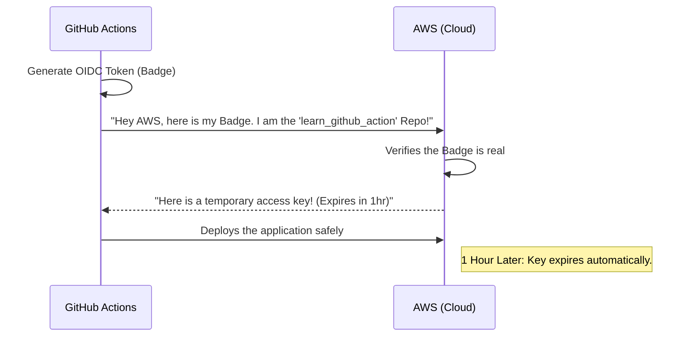

# Topic 10: Security & OIDC (OpenID Connect)

## 📖 The Problem with Long-Lived Secrets
In Topic 2, we learned how to store passwords and API keys in GitHub Secrets. For many years, to deploy code to cloud providers like AWS or Google Cloud, you had to generate an Admin Password, save it in GitHub Secrets, and use it in your workflows.

The problem? **If a hacker steals that password, they have permanent access to your cloud account.** You have to manually remember to rotate (change) these passwords every few months, which is a massive headache for security teams.

## 💡 The Solution: OIDC
OIDC (OpenID Connect) is a modern, enterprise-grade security protocol. It eliminates the need to store cloud passwords in GitHub altogether!

Instead of saving a password, you configure AWS to simply **trust** your specific GitHub repository.

### How it works:
1. Your workflow starts running.
2. The workflow asks GitHub for a cryptographically signed OIDC "badge" (a JWT token).
3. The workflow knocks on the AWS door and shows the badge.
4. AWS verifies the badge. It says: *"Yes, I see this is the 'learn_github_action' repository. Here is a temporary access key that expires in 1 hour."*
5. Your workflow deploys the code.
6. One hour later, the key automatically self-destructs!

### Architecture Diagram

## 🛠️ Why Principal Engineers love OIDC
- **Zero Secrets:** You literally do not have a password to steal. 
- **Auto-expiring:** If a hacker somehow intercepts the workflow, the keys self-destruct in an hour anyway.
- **Granular Security:** You can configure your cloud provider to say: *"I will ONLY give temporary keys if the workflow is running on the `main` branch."* If someone runs it on a feature branch, it gets blocked!
